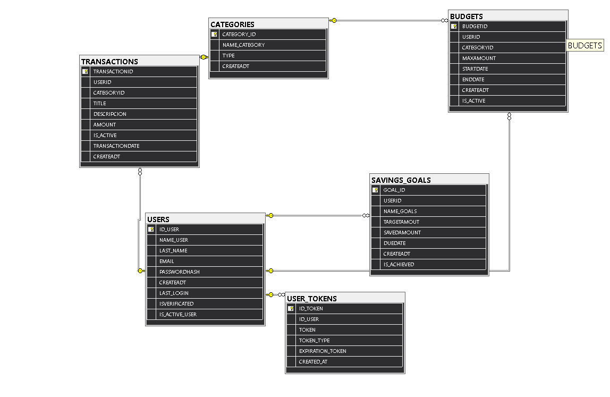

# 💰 MONETIX_DB — Sistema de Gestión de Finanzas Personales

**MONETIX_APP** es una base de datos en desarrollo construida con **SQL Server**, enfocada en la administración de ingresos, gastos, presupuestos y metas de ahorro. Este proyecto forma parte de un enfoque práctico para aplicar conocimientos avanzados en diseño y gestión de bases de datos relacionales.

> ⚠️ **Nota:** Este proyecto aún está en proceso de mejora. Se irán añadiendo nuevas funcionalidades, optimizaciones y documentación a medida que avance su desarrollo.

---

## 📁 Estructura del Proyecto
📦 MONETIX_APP ├── BACKUP/ │ └── monetix.bak ├── DIAGRAM/ │ └── DIAGRAM01.png ├── TABLES.SQL ├── INSERT.SQL ├── CRUD.SQL ├── OBJECT.SQL └── README.md

---

## 🧱 Estructura de Tablas

- **USERS** – Información de los usuarios registrados.
- **CATEGORIES** – Clasificación de ingresos/gastos.
- **TRANSACTIONS** – Registros financieros.
- **BUDGETS** – Límites de gasto por categoría.
- **SAVINGS_GOALS** – Metas de ahorro.

---

## 🛠️ Componentes Destacados

### 📊 Vistas

- `VW_SUMMARY_OF_TRANSACTIONS`: Resumen de ingresos/gastos por categoría y usuario.

### 🔄 Triggers

- `DELETE_TRANSACTION_LOGIC`: Reemplaza el borrado físico por una desactivación lógica (`IS_ACTIVE = 0`).

### ⚙️ Procedimientos Almacenados (en progreso)

- Inserción y consulta de datos.
- Desactivación de usuarios inactivos.
- Consultas de control y monitoreo.

### 🧠 Índices

- Mejorarán la eficiencia en las consultas frecuentes.

---

## 📷 Diagrama Entidad-Relación

---

## 🚀 Cómo usar el proyecto

1. Restaura la base de datos desde `monetix.bak` o ejecuta los scripts en orden:
   - `TABLES.SQL`
   - `INSERT.SQL`
   - `OBJECT.SQL`
   - `CRUD.SQL` para pruebas

2. Explora la vista `VW_SUMMARY_OF_TRANSACTIONS` y el trigger `DELETE_TRANSACTION_LOGIC`.

---

## 🔧 Mejoras Planeadas

- Nuevas vistas para reportes por fecha.
- Agregado de funciones y procedimientos almacenados avanzados.
- Panel de control en Excel con visualizaciones (Power Query).
- Seguridad mediante roles y permisos.

---

## 👩‍💻 Autor

**Mayory Astacio Reyna**  
Desarrollador Jr. | Estudiante de Ing. en Sistemas | Enfocado en datos, backend y automatización.

